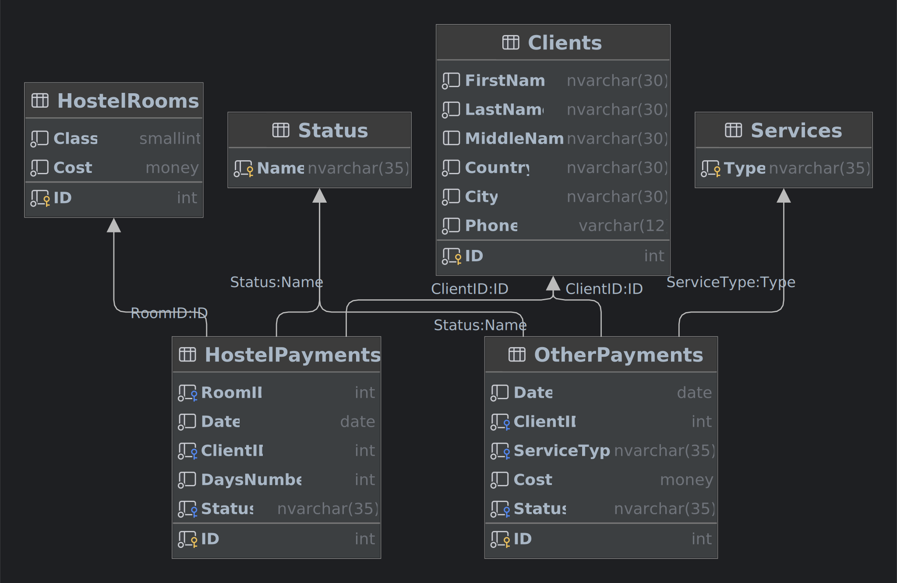

# Лабораторная работа №1 «Хранимые подпрограммы»

## Предусловие

Физическая модель базы данных: используем логическую модель, разрабатываемую в течении 1-го семестра. Выбор СУБД на
усмотрение студента.

Модель базы данных:



Скрипт создания базы данных:

```sql
USE model;
DROP DATABASE IF EXISTS lessonsUTMN;
GO

CREATE DATABASE lessonsUTMN;
GO

USE lessonsUTMN;

-- Таблица-справочник «Дополнительные услуги»
CREATE TABLE Services
(
    Type NVARCHAR(35) -- Тип услуги;
        CONSTRAINT PK_Services PRIMARY KEY
);

-- Таблица-справочник «Статусы платежа»
CREATE TABLE Status
(
    Name NVARCHAR(35) -- Статус платежа;
        CONSTRAINT PK_Name PRIMARY KEY
);

-- Таблица «Клиенты»
CREATE TABLE Clients
(
    ID         INT IDENTITY,          -- Идентификатор клиента;
    FirstName  NVARCHAR(30) NOT NULL, -- Имя;                    ПО ЗАДАНИЮ;
    LastName   NVARCHAR(30) NOT NULL, -- Фамилия;                ПО ЗАДАНИЮ;
    MiddleName NVARCHAR(30) NULL,     -- Отчество;
    Country    NVARCHAR(30) NOT NULL, -- Страна;                 ПО ЗАДАНИЮ;
    City       NVARCHAR(30) NOT NULL, -- Город;                  ПО ЗАДАНИЮ;
    Phone      VARCHAR(12)  NOT NULL, -- Номер телефона;         ПО ЗАДАНИЮ;
    CONSTRAINT PK_Clients PRIMARY KEY (ID),
    CONSTRAINT UQ_Clients_Phone UNIQUE (Phone),
    CONSTRAINT CH_Clients_Phone CHECK (Phone LIKE N'+[0-9][0-9][0-9][0-9][0-9][0-9][0-9][0-9][0-9][0-9][0-9]')
);

-- Таблица «Номера отеля»
CREATE TABLE HostelRooms
(
    ID    INT      NOT NULL, -- Номер номера;            ПО ЗАДАНИЮ;
    Class SMALLINT NOT NULL, -- Класс;                   ПО ЗАДАНИЮ;
    Cost  MONEY    NOT NULL, -- Стоимость за один день;  ПО ЗАДАНИЮ;
    CONSTRAINT PK_HostelRooms PRIMARY KEY (ID),
    CONSTRAINT CH_HostelRooms_Class CHECK (Class > 0 AND Class <= 5),
    CONSTRAINT CH_HostelRooms_Cost CHECK (Cost > 0)
);

-- Таблица «Платежи за отель»
CREATE TABLE HostelPayments
(
    ID         INT IDENTITY,          -- Номер платежа;
    RoomID     INT          NOT NULL, -- Номер комнаты;          ПО ЗАДАНИЮ;
    Date       DATE         NOT NULL  -- Дата платежа;           ПО ЗАДАНИЮ;
        CONSTRAINT DF_HostelPayments_Date DEFAULT GETDATE(),
    ClientID   INT          NOT NULL, -- Идентификатор клиента;  ПО ЗАДАНИЮ;
    DaysNumber INT          NOT NULL  -- Количество дней;        ПО ЗАДАНИЮ;
        CONSTRAINT DF_HostelPayments_DaysNumber DEFAULT 1,
    Status     NVARCHAR(35) NOT NULL, -- Статус платежа;
    CONSTRAINT PK_HostelPayments PRIMARY KEY (ID),
    CONSTRAINT FK_HostelPayments_RoomId FOREIGN KEY (RoomID)
        REFERENCES HostelRooms (ID)
        ON DELETE CASCADE
        ON UPDATE CASCADE,
    CONSTRAINT FK_HostelPayments_ClientID FOREIGN KEY (ClientID)
        REFERENCES Clients (ID)
        ON DELETE CASCADE
        ON UPDATE CASCADE,
    CONSTRAINT CH_HostelPayments_DaysNumber CHECK (DaysNumber > 0),
    CONSTRAINT FK_HostelPayments_Status FOREIGN KEY (Status)
        REFERENCES Status (Name)
        ON DELETE CASCADE
        ON UPDATE CASCADE
);

-- Таблица «Платежи за другие услуги»
CREATE TABLE OtherPayments
(
    ID          INT IDENTITY,          -- Номер платежа;
    Date        DATE         NOT NULL, -- Дата платежа;           ПО ЗАДАНИЮ;
    ClientID    INT          NOT NULL, -- Индентификатор клиента; ПО ЗАДАНИЮ;
    ServiceType NVARCHAR(35) NOT NULL, -- Тип услуги;             ПО ЗАДАНИЮ;
    Cost        MONEY        NOT NULL, -- Размер оплаты;          ПО ЗАДАНИЮ;
    Status      NVARCHAR(35) NOT NULL, -- Статус платежа;
    CONSTRAINT PK_OtherPayments PRIMARY KEY (ID),
    CONSTRAINT FK_OtherPayments_ClientID FOREIGN KEY (ClientID)
        REFERENCES Clients (ID)
        ON DELETE CASCADE
        ON UPDATE CASCADE,
    CONSTRAINT FK_OtherPayments_ServiceType FOREIGN KEY (ServiceType)
        REFERENCES Services (Type)
        ON DELETE CASCADE
        ON UPDATE CASCADE,
    CONSTRAINT FK_OtherPayments_Status FOREIGN KEY (Status)
        REFERENCES Status (Name)
        ON DELETE CASCADE
        ON UPDATE CASCADE,
);
GO
```

## Задание №1

Создание хранимой процедуры (функции), реализующей выборку данных из нескольких таблиц.

```sql
-- Процедура выводит обобщённую информацию об всех платёжках, то есть включает в себя данные 
-- с таблиц «Платежи за отель» и «Платежи за другие услуги»
CREATE OR ALTER PROCEDURE ShowAllPayRecords AS
SELECT N'Комната №' + CONVERT(NVARCHAR, RoomID) AS Услуга,
       Date                                     AS Дата,
       C1.FirstName                             AS Имя,
       C1.LastName                              AS Фамилия,
       C1.MiddleName                            AS Отчество,
       C1.Phone                                 AS Телефон,
       DaysNumber * HostelRooms.Cost            AS Стоимость
FROM HostelPayments
         LEFT OUTER JOIN Clients C1 ON HostelPayments.ClientID = C1.ID
         LEFT OUTER JOIN HostelRooms ON HostelPayments.RoomID = HostelRooms.ID
UNION
SELECT ServiceType, Date, C2.FirstName, C2.LastName, C2.MiddleName, C2.Phone, Cost
FROM OtherPayments
         LEFT JOIN Clients C2 ON C2.ID = ClientID
ORDER BY N'Дата';
GO

-- Проверка:
EXECUTE ShowAllPayRecords;
```

## Задание №2

Создание хранимой процедуры (функции), обеспечивающей формирование агрегированных данных для указанного интервала
календарных дат.

```sql
-- Процедура выводит таблицу с агрегированными данными по платёжкам за дополнительные услуги
CREATE OR ALTER PROCEDURE GetAggregate @StartDate DATE,
                                       @EndDate DATE AS
SELECT SUM(Cost)                          AS Всего,
       AVG(Cost)                          AS Среднее,
       MAX(Cost)                          AS Максимальная,
       MIN(Cost)                          AS Минимальная,
       (SELECT TOP 1 ServiceType
        FROM OtherPayments
        WHERE Date BETWEEN @StartDate AND @EndDate
        GROUP BY ServiceType
        ORDER BY COUNT(ServiceType) DESC) AS N'Самая востребованная услуга'
FROM OtherPayments
WHERE Date BETWEEN @StartDate AND @EndDate
GO

-- Проверка:
EXECUTE GetAggregate '0001-01-01', '2023-03-31';
```

## Задание №3

Создание хранимой процедуры, которая реализует различные операции модификации данных для таблицы.

```sql
-- ВЗЯТО ИЗ ТЕСТОВОЙ РАБОТЫ ЗА 5 СЕММЕСТР

-- Процедура для добавления нового клиента
CREATE OR ALTER PROCEDURE AddClient @FirstName NVARCHAR(30),
                                    @LastName NVARCHAR(30),
                                    @MiddleName NVARCHAR(30),
                                    @Country NVARCHAR(30),
                                    @City NVARCHAR(30),
                                    @Phone VARCHAR(12) AS
BEGIN
    -- Добавление нового клиента
    INSERT INTO Clients (FirstName, LastName, MiddleName, Country, City, Phone)
    VALUES (@FirstName, @LastName, @MiddleName, @Country, @City, @Phone);

    -- Вывод записи о добавленном клиенте
    SELECT *
    FROM Clients
    WHERE Phone = @Phone;
END
GO

-- Процедура для добавления нового платежа за отель
CREATE OR ALTER PROCEDURE AddHotelPayment @RoomID INT,
                                          @Date DATE,
                                          @ClientID INT,
                                          @DaysNumber INT,
                                          @Status NVARCHAR(35) AS
BEGIN
    -- Добавление нового платежа за отель
    INSERT INTO HostelPayments (RoomID, Date, ClientID, DaysNumber, Status)
    VALUES (@RoomID, @Date, @ClientID, @DaysNumber, @Status);

    -- Вывод записи о добавленном платеже за отель
    SELECT *
    FROM HostelPayments
    WHERE RoomID = @RoomID
      AND Date = @Date
      AND ClientID = @ClientID
      AND DaysNumber = @DaysNumber
      AND Status = @Status;
END
GO

-- Процедура для добавления нового платежа за другие услуги
CREATE OR ALTER PROCEDURE AddOtherPayment @Date DATE,
                                          @ClientID INT,
                                          @ServiceType NVARCHAR(35),
                                          @Cost MONEY,
                                          @Status NVARCHAR(35) AS
BEGIN
    -- Добавление нового платежа за другие услуги
    INSERT INTO OtherPayments (Date, ClientID, ServiceType, Cost, Status)
    VALUES (@Date, @ClientID, @ServiceType, @Cost, @Status);

    -- Вывод записи о добавленном платеже за другие услуги
    SELECT *
    FROM OtherPayments
    WHERE Date = @Date
      AND ClientID = @ClientID
      AND ServiceType = @ServiceType
      AND Cost = @Cost
      AND Status = @Status;
END
GO

-- Процедура для изменения данных о клиенте
CREATE OR ALTER PROCEDURE EditClient @ID INT,
                                     @FirstName NVARCHAR(30) = NULL,
                                     @LastName NVARCHAR(30) = NULL,
                                     @MiddleName NVARCHAR(30) = NULL,
                                     @Country NVARCHAR(30) = NULL,
                                     @City NVARCHAR(30) = NULL,
                                     @Phone VARCHAR(12) = NULL AS
BEGIN
    -- Проверка @ID на NOT NULL
    IF @ID IS NULL
        THROW 50001, N'Параметр @ID не может быть NULL', 1;

    -- Изменение данных о клиенте
    IF @FirstName IS NOT NULL
        UPDATE Clients
        SET FirstName = @FirstName
        WHERE ID = @ID;

    IF @LastName IS NOT NULL
        UPDATE Clients
        SET LastName = @LastName
        WHERE ID = @ID;

    IF @MiddleName IS NOT NULL
        UPDATE Clients
        SET MiddleName = @MiddleName
        WHERE ID = @ID;

    IF @Country IS NOT NULL
        UPDATE Clients
        SET Country = @Country
        WHERE ID = @ID;

    IF @City IS NOT NULL
        UPDATE Clients
        SET City = @City
        WHERE ID = @ID;

    IF @Phone IS NOT NULL
        UPDATE Clients
        SET Phone = @Phone
        WHERE ID = @ID;

    -- Вывод изменённой записи о клиенте
    SELECT *
    FROM Clients
    WHERE ID = @ID;
END
GO

-- Процедура для изменения записи о платеже за отель
CREATE OR ALTER PROCEDURE EditHotelPayment @ID INT,
                                           @RoomID INT = NULL,
                                           @Date DATE = NULL,
                                           @ClientID INT = NULL,
                                           @DaysNumber INT = NULL,
                                           @Status NVARCHAR(35) = NULL AS
BEGIN
    -- Проверка @ID на NOT NULL
    IF @ID IS NULL
        THROW 50001, N'Параметр @ID не может быть NULL', 1;

    -- Изменение записи о платеже за отель
    IF @RoomID IS NOT NULL
        UPDATE HostelPayments
        SET RoomID = @RoomID
        WHERE ID = @ID;

    IF @Date IS NOT NULL
        UPDATE HostelPayments
        SET Date = @Date
        WHERE ID = @ID;

    IF @ClientID IS NOT NULL
        UPDATE HostelPayments
        SET ClientID = @ClientID
        WHERE ID = @ID;

    IF @DaysNumber IS NOT NULL
        UPDATE HostelPayments
        SET DaysNumber = @DaysNumber
        WHERE ID = @ID;

    IF @Status IS NOT NULL
        UPDATE HostelPayments
        SET Status = @Status
        WHERE ID = @ID;

    -- Вывод измененной записи о платеже за отель
    SELECT *
    FROM HostelPayments
    WHERE ID = @ID;
END
GO

-- Процедура для изменения записи о платеже за другие услуги
CREATE OR ALTER PROCEDURE EditOtherPayment @ID INT,
                                           @Date DATE = NULL,
                                           @ClientID INT = NULL,
                                           @ServiceType NVARCHAR(35) = NULL,
                                           @Cost MONEY = NULL,
                                           @Status NVARCHAR(35) = NULL AS
BEGIN
    -- Проверка @ID на NOT NULL
    IF @ID IS NULL
        THROW 50001, N'Параметр @ID не может быть NULL', 1;

    -- Изменение записи о платеже за другие услуги
    IF @Date IS NOT NULL
        UPDATE OtherPayments
        SET Date = @Date
        WHERE ID = @ID;

    IF @ClientID IS NOT NULL
        UPDATE OtherPayments
        SET ClientID = @ClientID
        WHERE ID = @ID;

    IF @ServiceType IS NOT NULL
        UPDATE OtherPayments
        SET ServiceType = @ServiceType
        WHERE ID = @ID;

    IF @Cost IS NOT NULL
        UPDATE OtherPayments
        SET Cost = @Cost
        WHERE ID = @ID;

    IF @Status IS NOT NULL
        UPDATE OtherPayments
        SET Status = @Status
        WHERE ID = @ID;

    -- Вывод измененной записи о платеже за другие услуги
    SELECT *
    FROM OtherPayments
    WHERE ID = @ID;
END
GO

-- Процедура для удаления записи о платеже за отель
CREATE OR ALTER PROCEDURE DeleteHotelPayment @ID INT AS
BEGIN
    -- Проверка @ID на NOT NULL
    IF @ID IS NULL THROW 50001, N'Параметр @ID не может быть NULL', 1;

    -- Удаление записи о платеже за отель
    DELETE
    FROM HostelPayments
    WHERE ID = @ID;
END
GO

-- Процедура для удаления записи о платеже за другие услуги
CREATE OR ALTER PROCEDURE DeleteOtherPayment @ID INT AS
BEGIN
    -- Проверка @ID на NOT NULL
    IF @ID IS NULL THROW 50001, N'Параметр @ID не может быть NULL', 1;

    -- Удаление записи о платеже за другие услуги
    DELETE
    FROM OtherPayments
    WHERE ID = @ID;
END
GO
```

## Дополнительная информация

[Документаця PostgreSQL 15: Создание хранимых процедур](https://www.postgresql.org/docs/current/sql-createprocedure.html)

[Руководство по MySql: Создание процедур и функций](https://dev.mysql.com/doc/refman/8.0/en/create-procedure.html)